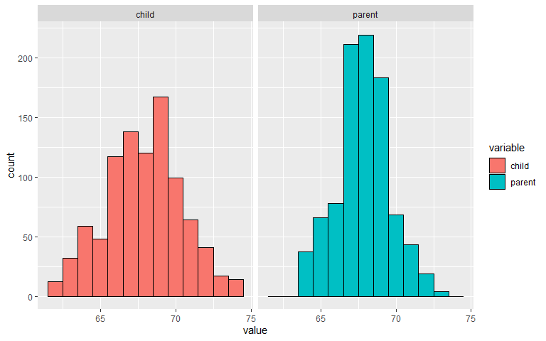

## **week 1** 

### **Introduction to regression**

**Power of the regression**: The models are parsimonious, they describe the data in an easy way. Difference with machine learning

**The creator of the regression**: Francis Galton


**Basic Least squares**


```r
library(UsingR)
```

```
## Warning: package 'UsingR' was built under R version 4.0.5
```

```
## Warning: package 'HistData' was built under R version 4.0.5
```

```r
library(ggplot2)
library(reshape2)
data(galton)
str(galton)

long <- melt(galton)
```


Look at the *marginal distributions* of parents and children height


```r
g <- ggplot(long, aes(x = value, fill = variable))
g <- g + geom_histogram(colour = "black", binwidth=1)
g <- g + facet_grid(. ~ variable)
g
```




Let´s only look to the children heights:

* How can we find the best predictor to the children heights?
* The *middle* could be a good predictor
* An math approximation to it is 

<center>

</center>


