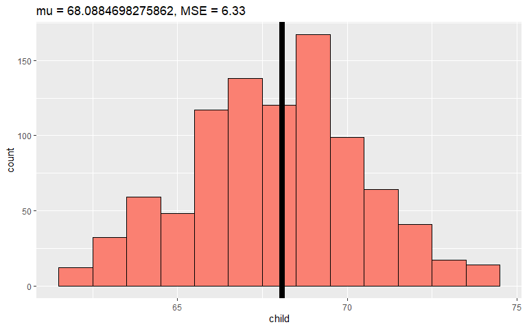
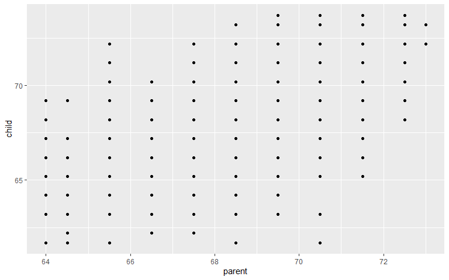
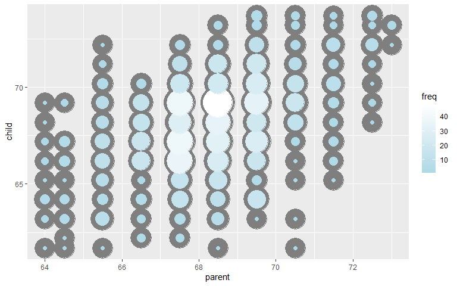
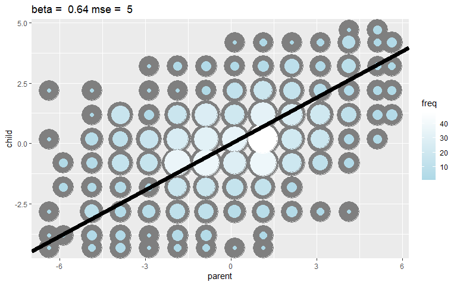
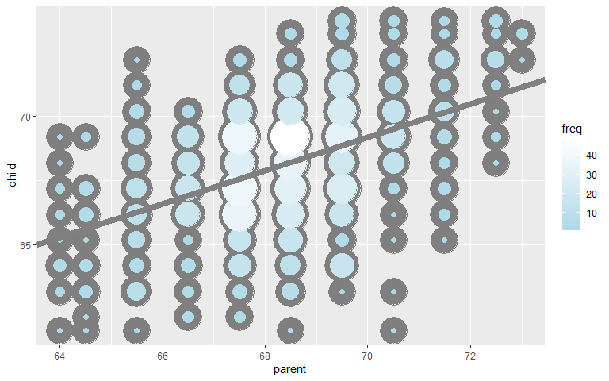

**Week 1** 
==============

## **Introduction to regression**

**Power of the regression**: The models are parsimonious, they describe the data in an easy way. Difference with machine learning

**The creator of the regression**: Francis Galton


## **Basic Least squares**


```r
library(UsingR)
```

```
## Warning: package 'UsingR' was built under R version 4.0.5
```

```
## Warning: package 'HistData' was built under R version 4.0.5
```

```r
library(ggplot2)
library(reshape2)
library(manipulate)
library(dplyr)


data(galton)
```


Look at the *marginal distributions* of parents and children height


```r
long <- melt(galton)
```

```
## No id variables; using all as measure variables
```

```r
g <- ggplot(long, aes(x = value, fill = variable))
g <- g + geom_histogram(colour = "black", binwidth=1)
g <- g + facet_grid(. ~ variable)
g
```


Let´s only look to the children heights:

* How can we find the best predictor to the children heights?
* The *middle* could be a good predictor
* An math approximation to it is...

The the value of *u* that minimize...

 $$\sum_{i=1}^n (Y_i - \mu)^2$$


* This can be a physical center of mass of the histogram
* The answer is **the mean**

An experiment...

```r
myHist <- function(mu){
        mse <- mean((galton$child - mu)^2)
        g <- ggplot(galton, aes(x = child)) + geom_histogram(fill = "salmon",
        colour = "black", binwidth=1)
        g <- g + geom_vline(xintercept = mu, size = 3)
        g <- g + ggtitle(paste("mu = ", mu, ", MSE = ", round(mse, 2), sep = ""))
        g
}

myHist(mean(galton$child))
```



**Mean square error**: The mean of the square distances between the observe data points and that particular *u*

As mu approximates the mean, the msq gets lower.
  
   
## **Technical details**
 

The math proof of the past experiment...

$$
\begin{align} 
\sum_{i=1}^n \left(Y_i - \mu\right)^2 & = \
\sum_{i=1}^n \left(Y_i - \bar Y + \bar Y - \mu\right)^2 \\ 
& = \sum_{i=1}^n \left(Y_i - \bar Y\right)^2 + \
2 \sum_{i=1}^n \left(Y_i - \bar Y\right)  \left(\bar Y - \mu\right) +\
\sum_{i=1}^n \left(\bar Y - \mu\right)^2 \\
& = \sum_{i=1}^n \left(Y_i - \bar Y\right)^2 + \
2 \left(\bar Y - \mu\right) \sum_{i=1}^n \left(Y_i - \bar Y\right) +\
\sum_{i=1}^n \left(\bar Y - \mu\right)^2 \\
& = \sum_{i=1}^n \left(Y_i - \bar Y\right)^2 + \
2 \left(\bar Y - \mu\right)  \left(\left(\sum_{i=1}^n Y_i\right) -\
 n \bar Y\right) +\
\sum_{i=1}^n \left(\bar Y - \mu\right)^2 \\
& = \sum_{i=1}^n \left(Y_i - \bar Y\right)^2 + \
 \sum_{i=1}^n \left(\bar Y - \mu\right)^2\\ 
& \geq \sum_{i=1}^n \left(Y_i - \bar Y\right)^2 \
\end{align} 
$$

## **Introductory data example**

Comparing children’s heights and their parent’s
heights


```r
data(galton)
ggplot(galton, aes(x = parent, y = child)) + geom_point()
```



The overplotting is clearly hiding some data. 


```r
freqData <- as.data.frame(table(galton$child, galton$parent))
names(freqData) <- c("child", "parent", "freq")
freqData$child <- as.numeric(as.character(freqData$child))
freqData$parent <- as.numeric(as.character(freqData$parent))

g <- ggplot(filter(freqData, freq > 0), aes(x = parent, y = child))
g <- g  + scale_size(range = c(2, 20), guide = "none")
g <- g + geom_point(colour="grey50", aes(size = freq+20, show_guide = FALSE))
```

```
## Warning: Ignoring unknown aesthetics: show_guide
```

```r
g <- g + geom_point(aes(colour=freq, size = freq))
g <- g + scale_colour_gradient(low = "lightblue", high="white")                    
g
```




### **Regression through the origin**

We want to explain the child heights with the parent heights... with a line (no intercept.. no keep it simple)

Consider picking the slope $\beta$ that minimizes $$\sum_{i=1}^n (Y_i - X_i \beta)^2$$
remember that $$X_i \beta$$ is the line.. the fitted value


this is exactly to use the origin as a pivot point and pick the line that minimizes the sum of the squared vertical distances of the points to the line.


We can do an experiment.. change the betas and look what happens with the MSE

```r
y <- galton$child - mean(galton$child)
x <- galton$parent - mean(galton$parent)

freqData <- as.data.frame(table(x, y))
names(freqData) <- c("child", "parent", "freq")

freqData$child <- as.numeric(as.character(freqData$child))
freqData$parent <- as.numeric(as.character(freqData$parent))

myPlot <- function(beta){
        g <- ggplot(filter(freqData, freq > 0), aes(x = parent, y = child))
        g <- g + scale_size(range = c(2, 20), guide = "none" )
        g <- g + geom_point(colour="grey50", aes(size = freq+20), show.legend = FALSE)
        g <- g + geom_point(aes(colour=freq, size = freq))
        g <- g + scale_colour_gradient(low = "lightblue", high="white")
        g <- g + geom_abline(intercept = 0, slope = beta, size = 3)
        mse <- mean( (y - beta * x) ^2 )
        g <- g + ggtitle(paste("beta = ", beta, "mse = ", round(mse, 3)))
        g
}

myPlot(0.64)
```




But there is a more easy solution with the function *lm*.


```r
lm(I(child - mean(child)) ~ I(parent - mean(parent)) - 1, data = galton)
```

```
## 
## Call:
## lm(formula = I(child - mean(child)) ~ I(parent - mean(parent)) - 
##     1, data = galton)
## 
## Coefficients:
## I(parent - mean(parent))  
##                   0.6463
```

put -1 to eliminate the intercept


Same exercise with intercept


```r
freqData <- as.data.frame(table(galton$child, galton$parent))
names(freqData) <- c("child", "parent", "freq")
freqData$child <- as.numeric(as.character(freqData$child))
freqData$parent <- as.numeric(as.character(freqData$parent))
g <- ggplot(filter(freqData, freq > 0), aes(x = parent, y = child))
g <- g  + scale_size(range = c(2, 20), guide = "none" )
g <- g + geom_point(colour="grey50", aes(size = freq+20, show_guide = FALSE))
```

```
## Warning: Ignoring unknown aesthetics: show_guide
```

```r
g <- g + geom_point(aes(colour=freq, size = freq))
g <- g + scale_colour_gradient(low = "lightblue", high="white")                    
lm1 <- lm(galton$child ~ galton$parent)
g <- g + geom_abline(intercept = coef(lm1)[1], slope = coef(lm1)[2], size = 3, colour = grey(.5))
g
```




