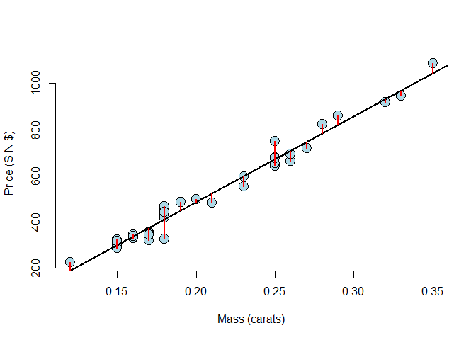
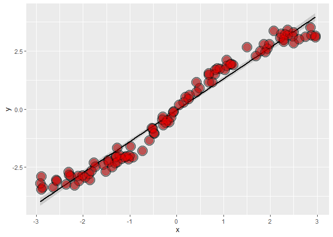
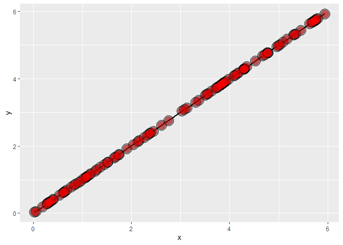
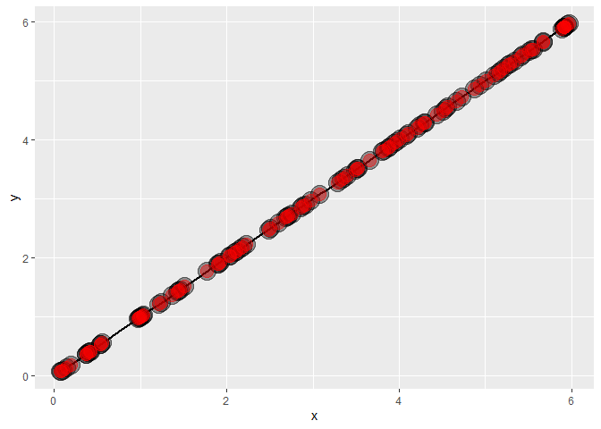
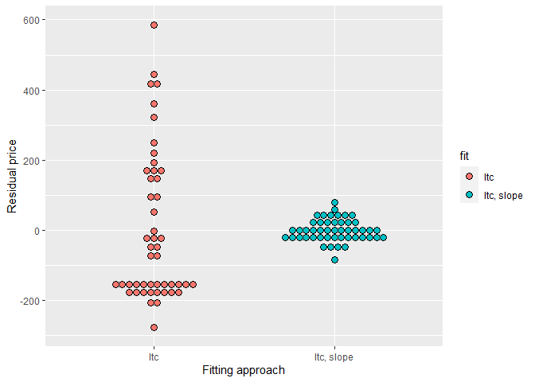

**Week 2** 
==============

## **Residuals and residual variation**

* Model $Y_i = \beta_0 + \beta_1 X_i + \epsilon_i$ where $\epsilon_i \sim N(0, \sigma^2)$.
* Observed outcome $i$ is $Y_i$ at predictor value $X_i$
* Predicted outcome $i$ is $\hat Y_i$ at predictor valuve $X_i$ is

$$
\hat Y_i = \hat \beta_0 + \hat \beta_1 X_i
$$

* Residual, the between the observed and predicted outcome

  $$
  e_i = Y_i - \hat Y_i
  $$
  
* The vertical distance between the observed data point and the regression line

* Least squares minimizes $\sum_{i=1}^n e_i^2$

* The $e_i$ can be thought of as estimates of the $\epsilon_i$.

* But be careful with this idea.. It´s easy to manipulate the residuals by adding irrelevant regressor into the equations 

### **Some important properties**

* $E[e_i] = 0$.}
*Their population expected value*

* If an intercept is included, $\sum_{i=1}^n e_i = 0$
*Their empirical sum, hence the empirical mean*
*Note this tells us that the residuals are not independent. If we know n−1 of them, we know the n th. In fact, we will only have n−p free residuals, where p is the number of coefficients in our regression model, so p = 2 for linear regression with an intercept and slope.*


* If a regressor variable, $X_i$, is included in the model $\sum_{i=1}^n e_i X_i = 0$.

* Residuals are useful for investigating poor model fit.

* Positive residuals are above the line, negative residuals are below.

* Residuals can be thought of as the outcome ($Y$) with the
  linear association of the predictor ($X$) removed.
  
* One differentiates residual variation (variation after removing
the predictor) from systematic variation (variation explained by the regression model).

* Residual plots highlight poor model fit.

### **Code example**


```r
library(UsingR)
library(ggplot2)
library(reshape2)
library(manipulate)
library(dplyr)
```


```r
data(diamond)
y <- diamond$price; x <- diamond$carat; n <- length(y)
fit <- lm(y ~ x)
## The easiest way to get the residuals RESID

e <- resid(fit)

## Obtain the residuals manually, get the predicted Ys first

yhat <- predict(fit)

## The residuals are y - yhat. Let's check by comparing this
## with R's build in resid function

max(abs(e -(y - yhat)))

## Let's do it again hard coding the calculation of Yhat

max(abs(e - (y - coef(fit)[1] - coef(fit)[2] * x)))


## Let´s see thie empirical mean 
sum(e) # really close to zero

sum(e*x)
```


```r
plot(diamond$carat, diamond$price,  
     xlab = "Mass (carats)", 
     ylab = "Price (SIN $)", 
     bg = "lightblue", 
     col = "black", cex = 2, pch = 21,frame = FALSE)
abline(fit, lwd = 2)
for (i in 1 : n) 
    lines(c(x[i], x[i]), c(y[i], yhat[i]), col = "red" , lwd = 2)
```

<!-- -->

But the graph is not useful for seeing the residual variation


```r
plot(x, e,  
     xlab = "Mass (carats)", 
     ylab = "Residuals (SIN $)", 
     bg = "lightblue", 
     col = "black", cex = 2, pch = 21,frame = FALSE)
abline(h = 0, lwd = 2)
for (i in 1 : n) 
  lines(c(x[i], x[i]), c(e[i], 0), col = "red" , lwd = 2)
```

<!-- -->

What are we searching? That the graph has a random form.. without any trend.. (X  exogenous)


**Pathological residual plots**


```r
x = runif(100, -3, 3); y = x + sin(x) + rnorm(100, sd = .2); # this is the model --- not lineal!!

library(ggplot2)
g = ggplot(data.frame(x = x, y = y), aes(x = x, y = y))
g = g + geom_smooth(method = "lm", colour = "black")
g = g + geom_point(size = 7, colour = "black", alpha = 0.4)
g = g + geom_point(size = 5, colour = "red", alpha = 0.4)
g
```

<!-- -->

```r
coef(lm(y ~ x))
```

In this case the lineal model is not the correct for the data. The model is only accounting for the lineal trend in the data, not for the secondary variation in the sin term


But having the correct nmodel is not the ultimate goal... You can have good insights with a deficient model.


```r
g = ggplot(data.frame(x = x, y = resid(lm(y ~ x))), 
           aes(x = x, y = y))
g = g + geom_hline(yintercept = 0, size = 2); 
g = g + geom_point(size = 7, colour = "black", alpha = 0.4)
g = g + geom_point(size = 5, colour = "red", alpha = 0.4)
g = g + xlab("X") + ylab("Residual")
g
```

<!-- -->

Now the sin term is extremly apparent.. The residual plot highlight the model problems

### **Heteroskedasticity**

```r
x <- runif(100, 0, 6); y <- x + rnorm(100,  mean = 0, sd = .001 * x); 
g = ggplot(data.frame(x = x, y = y), aes(x = x, y = y))
g = g + geom_smooth(method = "lm", colour = "black")
g = g + geom_point(size = 7, colour = "black", alpha = 0.4)
g = g + geom_point(size = 5, colour = "red", alpha = 0.4)
g
```

<!-- -->

Another common feature where our model fails is when the variance around the regression line is not constant. Remember our errors are assumed to be Gaussian with a constant error. Here’s an example where heteroskedasticity is not at all apparent in the scatterplot.


```r
x <- runif(100, 0, 6); y <- x + rnorm(100,  mean = 0, sd = .001 * x); 
g = ggplot(data.frame(x = x, y = y), aes(x = x, y = y))
g = g + geom_smooth(method = "lm", colour = "black")
g = g + geom_point(size = 7, colour = "black", alpha = 0.4)
g = g + geom_point(size = 5, colour = "red", alpha = 0.4)
g
```

<!-- -->
the *Heteroskedasticity* is really difficult to see in a scatterplor.


```r
g = ggplot(data.frame(x = x, y = resid(lm(y ~ x))), 
           aes(x = x, y = y))
g = g + geom_hline(yintercept = 0, size = 2); 
g = g + geom_point(size = 7, colour = "black", alpha = 0.4)
g = g + geom_point(size = 5, colour = "red", alpha = 0.4)
g = g + xlab("X") + ylab("Residual")
g
```

<!-- -->

There is a clear trend in the variance. Greater variability when the x variable increace.


### **Diamond data residual plot**


```r
diamond$e <- resid(lm(price ~ carat, data = diamond))
g = ggplot(diamond, aes(x = carat, y = e))
g = g + xlab("Mass (carats)")
g = g + ylab("Residual price (SIN $)")
g = g + geom_hline(yintercept = 0, size = 2)
g = g + geom_point(size = 7, colour = "black", alpha=0.5)
g = g + geom_point(size = 5, colour = "blue", alpha=0.2)
g
```

<!-- -->

**It seems a pretty good fit...**


```r
e = c(resid(lm(price ~ 1, data = diamond)), # variation around average price
      resid(lm(price ~ carat, data = diamond))) # variation around regression
fit = factor(c(rep("Itc", nrow(diamond)),
               rep("Itc, slope", nrow(diamond))))
g = ggplot(data.frame(e = e, fit = fit), aes(y = e, x = fit, fill = fit))
g = g + geom_dotplot(binaxis = "y", size = 2, stackdir = "center", binwidth = 20)
```

```
## Warning: Ignoring unknown parameters: size
```

```r
g = g + xlab("Fitting approach")
g = g + ylab("Residual price")
g
```

<!-- -->


**Model with just the intercept**: Variation around the mean --- variation in the variable..

**Model with lineal trend**: Variation around the regression --- smaller (we already explain a part of the variation)

**The subtraction of both**: variation that is explained by the regression model.

### **Estimating residual  variation**

Residual variation is the variation around the regression line

* Model $Y_i = \beta_0 + \beta_1 X_i + \epsilon_i$ where $\epsilon_i \sim N(0, \sigma^2)$.

* The ML estimate of $\sigma^2$ is $\frac{1}{n}\sum_{i=1}^n e_i^2$,
the average squared residual. (cause te average is 0)

* Most people use

$$
\hat \sigma^2 = \frac{1}{n-2}\sum_{i=1}^n e_i^2.
$$
This because we include two covariates (intercept and slope). When we include them we put constrains, so we lose the degrees of freedom.
  
* Also, the $n-2$ instead of $n$ is so that $E[\hat \sigma^2] = \sigma^2$ 


```r
y <- diamond$price; x <- diamond$carat; n <- length(y)
fit <- lm(y ~ x)
summary(fit)$sigma

# or we can calculate it with the formula
sqrt(sum(resid(fit)^2) / (n - 2))
```

### **Summarizing variation**

- The total variability in our response is the variability around an intercept (think mean only regression) $\sum_{i=1}^n (Y_i - \bar Y)^2$
- The regression variability is the variability that is explained by adding the predictor $\sum_{i=1}^n  (\hat Y_i - \bar Y)^2$
- The error variability is what's leftover around the regression line
$\sum_{i=1}^n (Y_i - \hat Y_i)^2$ (*the residual variability*)
- Neat fact
$$
\sum_{i=1}^n (Y_i - \bar Y)^2 
= \sum_{i=1}^n (Y_i - \hat Y_i)^2 + \sum_{i=1}^n  (\hat Y_i - \bar Y)^2 
$$
## **R squared**

- R squared is the percentage of the total variability that is explained
by the linear relationship with the predictor
$$
R^2 = \frac{\sum_{i=1}^n  (\hat Y_i - \bar Y)^2}{\sum_{i=1}^n (Y_i - \bar Y)^2}
$$
## Some facts about $R^2$
* $R^2$ is the percentage of variation explained by the regression model.
* $0 \leq R^2 \leq 1$
* $R^2$ is the sample correlation squared.
* $R^2$ can be a misleading summary of model fit. 
  * Deleting data can inflate $R^2$.
  * (For later.) Adding terms to a regression model always increases $R^2$.
* 

Do `example(anscombe)` to see the following data.
  * Basically same mean and variance of X and Y.
  * Identical correlations (hence same $R^2$ ).
  * Same linear regression relationship.


```r
require(stats); require(graphics); data(anscombe)
ff <- y ~ x
mods <- setNames(as.list(1:4), paste0("lm", 1:4))

for(i in 1:4) {
        ff[2:3] <- lapply(paste0(c("y","x"), i), as.name)
        ## or   ff[[2]] <- as.name(paste0("y", i))
        ##      ff[[3]] <- as.name(paste0("x", i))
        mods[[i]] <- lmi <- lm(ff, data = anscombe)
        #print(anova(lmi))
}

## Now, do what you should have done in the first place: PLOTS
op <- par(mfrow = c(2, 2), mar = 0.1+c(4,4,1,1), oma =  c(0, 0, 2, 0))
for(i in 1:4) {
        ff[2:3] <- lapply(paste0(c("y","x"), i), as.name)
        plot(ff, data = anscombe, col = "red", pch = 21, bg = "orange", cex = 1.2,
             xlim = c(3, 19), ylim = c(3, 13))
        abline(mods[[i]], col = "blue")
}
mtext("Anscombe's 4 Regression data sets", outer = TRUE, cex = 1.5)
```

<!-- -->

```r
par(op)
```

All these data set have the same $R^2$... So it does not give us the whole story 


## **How to derive R squared (Not required!)**
### **For those that are interested**
$$
\begin{align}
\sum_{i=1}^n (Y_i - \bar Y)^2 
& = \sum_{i=1}^n (Y_i - \hat Y_i + \hat Y_i - \bar Y)^2 \\
& = \sum_{i=1}^n (Y_i - \hat Y_i)^2 + 
2 \sum_{i=1}^n  (Y_i - \hat Y_i)(\hat Y_i - \bar Y) + 
\sum_{i=1}^n  (\hat Y_i - \bar Y)^2 \\
\end{align}
$$

****
### Scratch work
$(Y_i - \hat Y_i) = \{Y_i - (\bar Y - \hat \beta_1 \bar X) - \hat \beta_1 X_i\} = (Y_i - \bar Y) - \hat \beta_1 (X_i - \bar X)$

$(\hat Y_i - \bar Y) = (\bar Y - \hat \beta_1 \bar X - \hat \beta_1 X_i - \bar Y )
= \hat \beta_1  (X_i - \bar X)$

$\sum_{i=1}^n  (Y_i - \hat Y_i)(\hat Y_i - \bar Y) 
= \sum_{i=1}^n  \{(Y_i - \bar Y) - \hat \beta_1 (X_i - \bar X))\}\{\hat \beta_1  (X_i - \bar X)\}$

$=\hat \beta_1 \sum_{i=1}^n (Y_i - \bar Y)(X_i - \bar X) -\hat\beta_1^2\sum_{i=1}^n (X_i - \bar X)^2$

$= \hat \beta_1^2 \sum_{i=1}^n (X_i - \bar X)^2-\hat\beta_1^2\sum_{i=1}^n (X_i - \bar X)^2 = 0$


---
## The relation between R squared and r
### (Again not required)
Recall that $(\hat Y_i - \bar Y) = \hat \beta_1  (X_i - \bar X)$
so that
$$
R^2 = \frac{\sum_{i=1}^n  (\hat Y_i - \bar Y)^2}{\sum_{i=1}^n (Y_i - \bar Y)^2}
= \hat \beta_1^2  \frac{\sum_{i=1}^n(X_i - \bar X)^2}{\sum_{i=1}^n (Y_i - \bar Y)^2}
= Cor(Y, X)^2
$$
Since, recall, 
$$
\hat \beta_1 = Cor(Y, X)\frac{Sd(Y)}{Sd(X)}
$$
So, $R^2$ is literally $r$ squared.
