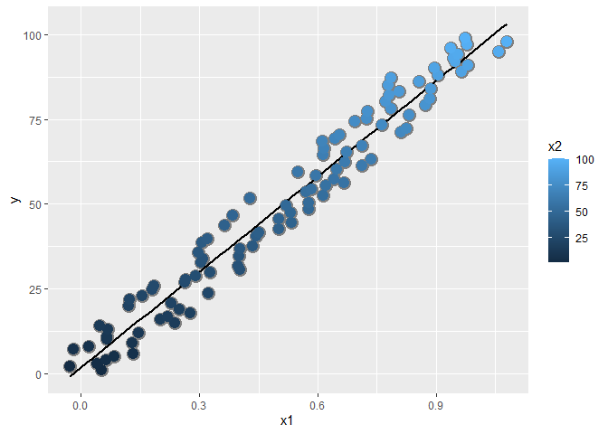
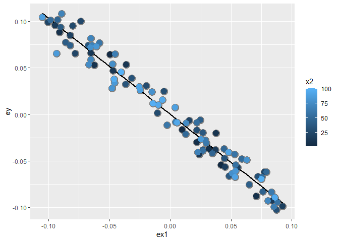

**Multivariable regression** 
==============

## **Initial notes**

**It´s ain objective**: Look at the relationship between a predictor and a response while accounting for the oter variables

**It´s other important objective**:  A method of prediction. 

**Complications**: Model search (how do we pick the predictors); Overfitting (artificialy decrease the residuals by including non important predictors); Omitting of important variables


## **The lineal model**

The general linear model extends simple linear regression (SLR)
by adding terms linearly into the model.
$$
Y_i =  \beta_1 X_{1i} + \beta_2 X_{2i} + \ldots +
\beta_{p} X_{pi} + \epsilon_{i} 
= \sum_{k=1}^p X_{ik} \beta_k + \epsilon_{i}
$$
* Here $X_{1i}=1$ typically, so that an intercept is included.     
 
* Least squares (and hence ML estimates under iid Gaussianity 
of the errors) minimizes

$$
\sum_{i=1}^n \left(Y_i - \sum_{k=1}^p X_{ki} \beta_k\right)^2
$$

* Note, the important linearity is linearity in the coefficients.
Thus

$$
Y_i =  \beta_1 X_{1i}^2 + \beta_2 X_{2i}^2 + \ldots +
\beta_{p} X_{pi}^2 + \epsilon_{i} 
$$

is still a linear model. (We've just squared the elements of the
predictor variables.)


## **How to get the estimates**

* Recall that the LS estimate for regression through the origin, $E[Y_i]=X_{1i}\beta_1$, was $\sum X_i Y_i / \sum X_i^2$.
* Let's consider two regressors, $E[Y_i] = X_{1i}\beta_1 + X_{2i}\beta_2 = \mu_i$. 
* Least squares tries to minimize

$$
\sum_{i=1}^n (Y_i - X_{1i} \beta_1 - X_{2i} \beta_2)^2
$$

## **Result**

$$\hat \beta_1 = \frac{\sum_{i=1}^n e_{i, Y | X_2} e_{i, X_1 | X_2}}{\sum_{i=1}^n e_{i, X_1 | X_2}^2}$$
 
* That is, the regression estimate for $\beta_1$ is the regression 
through the origin estimate having regressed $X_2$ out of both
the response and the predictor.
 
* (Similarly, the regression estimate for $\beta_2$ is the regression  through the origin estimate having regressed $X_1$ out of both the response and the predictor.)
 
* More generally, multivariate regression estimates are exactly those having removed the linear relationship of the other variables
from both the regressor and response.


# **Example with two variables, simple linear regression**

* $Y_{i} = \beta_1 X_{1i} + \beta_2 X_{2i}$ where  $X_{2i} = 1$ is an intercept term.
* Notice the fitted coefficient of $X_{2i}$ on $Y_{i}$ is $\bar Y$
    * The residuals $e_{i, Y | X_2} = Y_i - \bar Y$
* Notice the fitted coefficient of $X_{2i}$ on $X_{1i}$ is $\bar X_1$
    * The residuals $e_{i, X_1 | X_2}= X_{1i} - \bar X_1$
* Thus

$$
\hat \beta_1 = \frac{\sum_{i=1}^n e_{i, Y | X_2} e_{i, X_1 | X_2}}{\sum_{i=1}^n e_{i, X_1 | X_2}^2} = \frac{\sum_{i=1}^n (X_i - \bar X)(Y_i - \bar Y)}{\sum_{i=1}^n (X_i - \bar X)^2}
= Cor(X, Y) \frac{Sd(Y)}{Sd(X)}
$$

## **The general case**
* Least squares solutions have to minimize
$$
\sum_{i=1}^n (Y_i - X_{1i}\beta_1 - \ldots - X_{pi}\beta_p)^2
$$

* **The least squares estimate for the coefficient of a multivariate regression model is exactly regression through the origin with the linear relationships with the other regressors removed from both the regressor and outcome by taking residuals**.

* In this sense, multivariate regression "adjusts" a coefficient for the linear impact of the other variables. 


## **Code example**


```r
n = 100; x = rnorm(n); x2 = rnorm(n); x3 = rnorm(n)
y = 1 + x + x2 + x3 + rnorm(n, sd = .1)
ey = resid(lm(y ~ x2 + x3))
ex = resid(lm(x ~ x2 + x3))
sum(ey * ex) / sum(ex ^ 2)
```

```
## [1] 1.009138
```

```r
coef(lm(ey ~ ex - 1))
```

```
##       ex 
## 1.009138
```

```r
coef(lm(y ~ x + x2 + x3))
```

```
## (Intercept)           x          x2          x3 
##   1.0023864   1.0091385   1.0100655   0.9930739
```

So each coefficient of the LM is the regression through the origin with the linear relationships with the other regressors removed from both the regressor and outcome by taking residuals. (*The model can have an intercept, but it does not matter to the calculation*)

## **Interpretation of the coeficients**

$$E[Y | X_1 = x_1, \ldots, X_p = x_p] = \sum_{k=1}^p x_{k} \beta_k$$


$$
E[Y | X_1 = x_1 + 1, \ldots, X_p = x_p] = (x_1 + 1) \beta_1 + \sum_{k=2}^p x_{k} \beta_k
$$
$$E[Y | X_1 = x_1 + 1, \ldots, X_p = x_p]  - E[Y | X_1 = x_1, \ldots, X_p = x_p]$$ 
$$= (x_1 + 1) \beta_1 + \sum_{k=2}^p x_{k} \beta_k + \sum_{k=1}^p x_{k} \beta_k = \beta_1 $$

## **Fitted values, residuals and residual variation** 

All of our SLR quantities can be extended to linear models
 
* Model $Y_i = \sum_{k=1}^p X_{ik} \beta_{k} + \epsilon_{i}$ where $\epsilon_i \sim N(0, \sigma^2)$
 
* Fitted responses $\hat Y_i = \sum_{k=1}^p X_{ik} \hat \beta_{k}$
 
* Residuals $e_i = Y_i - \hat Y_i$
 
* Variance estimate $\hat \sigma^2 = \frac{1}{n-p} \sum_{i=1}^n e_i ^2$
 
* To get predicted responses at new values, $x_1, \ldots, x_p$, simply plug them into the linear model $\sum_{k=1}^p x_{k} \hat \beta_{k}$
 
* Coefficients have standard errors, $\hat \sigma_{\hat \beta_k}$, and
$\frac{\hat \beta_k - \beta_k}{\hat \sigma_{\hat \beta_k}}$
follows a $T$ distribution with $n-p$ degrees of freedom.
  
* Predicted responses have standard errors and we can calculate predicted and expected response intervals.

---


So that the interpretation of a multivariate regression coefficient is the expected change in the response per unit change in the regressor, holding all of the other regressors fixed.

In the next lecture, we'll do examples and go over context-specific
interpretations.

## **Linear models**

* Linear models are the single most important applied statistical and machine learning techniqe, *by far*.

* Some amazing things that you can accomplish with linear models

  * Decompose a signal into its harmonics.
  
  * Flexibly fit complicated functions.
  
  * Fit factor variables as predictors.
  
  * Uncover complex multivariate relationships with the response.
  
  * Build accurate prediction models.

## **Examples**


```r
library(UsingR)
```

```
## Warning: package 'UsingR' was built under R version 4.0.5
```

```
## Warning: package 'HistData' was built under R version 4.0.5
```

```
## Warning: package 'ggplot2' was built under R version 4.0.5
```

```r
library(ggplot2)
library(reshape2)
library(manipulate)
library(dplyr)
library(datasets)
library(GGally)
```

```
## Warning: package 'GGally' was built under R version 4.0.5
```


```r
data(swiss)
ggpairs(swiss, lower = list(continuous = wrap("smooth")))
```

<!-- -->

**First model**

Add all the variables in a linear form


```r
summary(lm(Fertility ~ . , data = swiss))$coefficients
```

```
##                    Estimate  Std. Error   t value     Pr(>|t|)
## (Intercept)      66.9151817 10.70603759  6.250229 1.906051e-07
## Agriculture      -0.1721140  0.07030392 -2.448142 1.872715e-02
## Examination      -0.2580082  0.25387820 -1.016268 3.154617e-01
## Education        -0.8709401  0.18302860 -4.758492 2.430605e-05
## Catholic          0.1041153  0.03525785  2.952969 5.190079e-03
## Infant.Mortality  1.0770481  0.38171965  2.821568 7.335715e-03
```

## Example interpretation 
  
* Agriculture is expressed in percentages (0 - 100)
   
* Estimate is -0.1721.
  
* Our models estimates an expected 0.17 decrease in standardized fertility for every 1% increase in percentage of males involved in agriculture in holding the remaining variables constant.
   
* The t-test for $H_0: \beta_{Agri} = 0$ versus $H_a: \beta_{Agri} \neq 0$ is  significant.
    
* Interestingly, the unadjusted estimate is 


```r
summary(lm(Fertility ~ Agriculture, data = swiss))$coefficients
```

```
##               Estimate Std. Error   t value     Pr(>|t|)
## (Intercept) 60.3043752 4.25125562 14.185074 3.216304e-18
## Agriculture  0.1942017 0.07671176  2.531577 1.491720e-02
```

The sign change.. **Sipson´s Paradox**

How can adjustment reverse the sign of an effect? Let's try a simulation.

```r
n <- 100; x2 <- 1 : n; x1 <- .01 * x2 + runif(n, -.1, .1); y = -x1 + x2 + rnorm(n, sd = .01)
summary(lm(y ~ x1))$coef # REALLY WRONG
```

```
##              Estimate Std. Error   t value     Pr(>|t|)
## (Intercept)  1.201763   1.195388  1.005333 3.172125e-01
## x1          95.861103   2.037679 47.044270 4.537450e-69
```

```r
# WHY? x1 PICK THE EFFECT OF X2 that is positive
summary(lm(y ~ x1 + x2))$coef
```

```
##                 Estimate   Std. Error     t value      Pr(>|t|)
## (Intercept) -0.002557693 0.0020124772   -1.270918  2.067973e-01
## x1          -1.000753536 0.0167395661  -59.783720  2.393219e-78
## x2           1.000030743 0.0001691942 5910.548564 2.617643e-271
```

```r
# Here we remove the linear effect of x2 in X1. And the uniform noise (that is the part of X1 that is unrelated to x2) will get related to the part of y that is unrelated to x2 
```


```r
dat = data.frame(y = y, x1 = x1, x2 = x2, ey = resid(lm(y ~ x2)), ex1 = resid(lm(x1 ~ x2)))
library(ggplot2)
g = ggplot(dat, aes(y = y, x = x1, colour = x2))
g = g + geom_point(colour="grey50", size = 5) + geom_smooth(method = lm, se = FALSE, colour = "black") 
g = g + geom_point(size = 4) 
g
```

<!-- -->

Notice the positive relationship. However, if we look at X2 (the color) notice that it clearly goes up with y.

So there is a **confounding** variable

If we adjust both the X1 and Y variable by taking the residual after having regressed X2, we get the actual correct relationship between X1 and Y.


```r
g2 = ggplot(dat, aes(y = ey, x = ex1, colour = x2))  
g2 = g2 + geom_point(colour="grey50", size = 5) + geom_smooth(method = lm, se = FALSE, colour = "black") + geom_point(size = 4) 
g2 # The slope is the coefficient of our mutivariable model
```

<!-- -->

```r
# and x2 is uncorrelaated with y 

sum(dat$ey * dat$ex1) / sum(dat$ex1 ^ 2)
```

```
## [1] -1.000754
```

```r
summary(lm(y ~ x1 + x2))$coef
```

```
##                 Estimate   Std. Error     t value      Pr(>|t|)
## (Intercept) -0.002557693 0.0020124772   -1.270918  2.067973e-01
## x1          -1.000753536 0.0167395661  -59.783720  2.393219e-78
## x2           1.000030743 0.0001691942 5910.548564 2.617643e-271
```

## **Back to the swiss data set**

* The sign reverses itself with the inclusion of Examination and Education.
    
* The percent of males in the province working in agriculture is negatively related to educational attainment (correlation of -0.6395225) and Education and Examination (correlation of 0.6984153) are obviously measuring similar things.
     
* Is the positive marginal an artifact for not having accounted for, say, Education level? (Education does have a stronger effect, by the way.)
     
* At the minimum, anyone claiming that provinces that are more agricultural have higher fertility rates would immediately be open to criticism.

## **What if we include an unnecessary variable?**


```r
z <- swiss$Agriculture + swiss$Education
lm(Fertility ~ . + z, data = swiss)
```

```
## Warning in terms.formula(formula, data = data): 'varlist' has changed (from
## nvar=6) to new 7 after EncodeVars() -- should no longer happen!
```

```
## 
## Call:
## lm(formula = Fertility ~ . + z, data = swiss)
## 
## Coefficients:
##      (Intercept)       Agriculture       Examination         Education  
##          66.9152           -0.1721           -0.2580           -0.8709  
##         Catholic  Infant.Mortality                 z  
##           0.1041            1.0770                NA
```

z adds no new linear information, since it's a linear combination of variables already included. R just drops  terms that are linear combinations of other terms.


